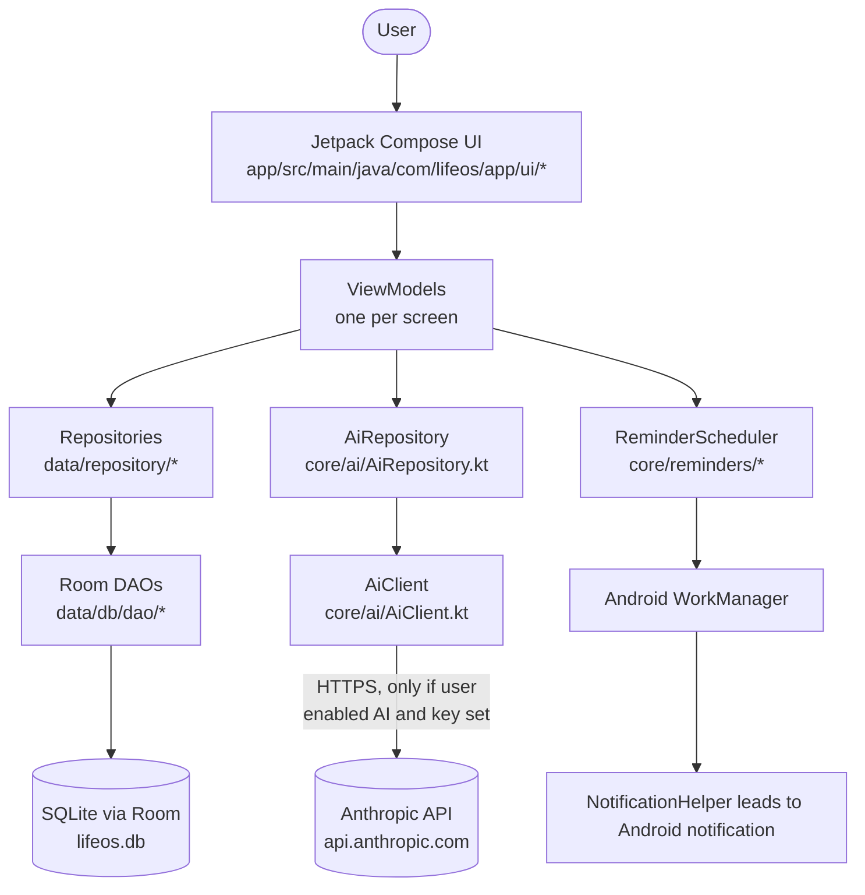
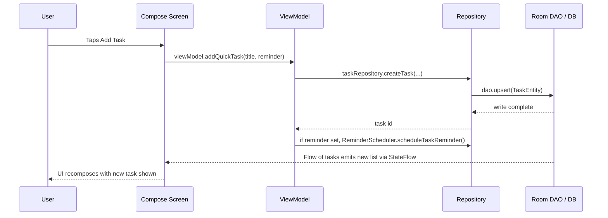

# 02 — Architecture

## High-level architecture

LifeOS is a **single-module, offline-first Android application**. There is
no backend server, no cloud database, and no multi-service architecture —
everything runs inside one APK on one device.

There is **no application server** and **no company-operated database** in
this codebase — data flows only between the UI, the ViewModels, the
repositories, and the on-device Room database, plus the one optional,
user-triggered call out to Anthropic's API.

## Frontend architecture

The entire "frontend" *is* the app — there is no separate web frontend.

- **UI toolkit**: Jetpack Compose (`androidx.compose.*`), Material 3.
- **Navigation**: `androidx.navigation:navigation-compose`, defined in
  `ui/navigation/Screen.kt` (route definitions) and
  `ui/navigation/LifeOSNavHost.kt` (the `NavHost` wiring every screen).
- **State management**: Each screen has a `ViewModel` (e.g.
  `ui/home/HomeViewModel.kt`, `ui/tasks/TasksScreen.kt`'s `TasksViewModel`)
  exposing Kotlin `StateFlow`s that the Composable screen collects with
  `collectAsState()`. There is no external state-management library
  (no Redux-equivalent); this is standard Android `ViewModel` + `StateFlow`.
- **Dependency access**: Screens/ViewModels reach shared dependencies
  (repositories, AI, settings) through a single `CompositionLocal`,
  `LocalServiceLocator` (`core/di/LocalServiceLocator.kt`), provided once at
  the root of the Compose tree in `MainActivity.kt`.

## Backend architecture

**There is no backend.** ⚠️ Confirmed by direct repository inspection: no
server directory, no Node/Python/Go server code, no Firebase configuration
file (`google-services.json` is absent), no `.env`-driven server process.
All "backend" logic (business rules, data access) lives on-device inside
the repository classes under `data/repository/` and the use-case classes
under `domain/usecase/`.

## Database architecture

See `docs/05_DATABASE.md` for full schema detail. Summary:

- **Engine**: SQLite, accessed through **Room** (`androidx.room`), version
  `2.6.1` (see `app/build.gradle.kts`).
- **Definition file**: `app/src/main/java/com/lifeos/app/data/db/AppDatabase.kt`
- **File name on device**: `lifeos.db` (set in `AppDatabase.getInstance()`)
- **Schema version**: `1` (declared in the `@Database(version = 1, ...)` annotation)
- No remote database, no ORM-to-cloud sync layer exists.

## Authentication architecture

**None exists.** See `docs/07_AUTHENTICATION.md`. The only access-control
mechanism is an optional biometric/PIN **App Lock** gate
(`core/security/AppLockManager.kt`), which is a device-level unlock, not a
user account system.

## API architecture

The only "API" the app calls is Anthropic's `POST /v1/messages` endpoint,
and only from `core/ai/AiClient.kt`. There is no REST/GraphQL API that this
app *exposes* — it has no server to expose one from. Full detail in
`docs/06_API_DOCUMENTATION.md`.

## External services

| Service | Purpose | Called from |
|---|---|---|
| Anthropic API (`api.anthropic.com`) | Optional AI features | `core/ai/AiClient.kt` |

No other third-party SDK or service (Firebase, analytics, crash reporting,
ads, payments, maps, push notification service) exists in the dependency
list (`app/build.gradle.kts`) or source code.

## Mobile architecture

This diagram shows the internal module layering used inside the single
Android app module (`app/`):

```mermaid
flowchart LR
    subgraph ui["ui/ (Compose screens + ViewModels)"]
        direction TB
        home[home/]
        notes[notes/]
        tasks[tasks/]
        habits[habits/]
        expenses[expenses/]
        diary[diary/]
        timeline[timeline/]
        capture[capture/]
        ai_ui[ai/]
        search[search/]
        settings[settings/]
        onboarding[onboarding/]
    end

    subgraph domain["domain/ (business logic, no Android deps)"]
        model[model/]
        usecase[usecase/]
    end

    subgraph data["data/ (persistence)"]
        repo[repository/]
        db[db/ Room entities and DAOs]
    end

    subgraph core["core/ (cross-cutting infrastructure)"]
        di[di/ ServiceLocator]
        ai_core[ai/ AiClient, AiRepository]
        security[security/ AppLockManager]
        reminders[reminders/ WorkManager]
        util[util/ DateTime, Settings, Permissions, Media, Notifications]
    end

    ui --> domain
    ui --> data
    ui --> core
    domain --> data
    core --> data
```

- `core/di/ServiceLocator.kt` is the single composition root: it constructs
  every repository, the database instance, the AI client, and every use
  case, and hands them out via `LocalServiceLocator`.
- There is **no Hilt/Dagger** — this is a deliberate choice; see
  `docs/24_ARCHITECTURAL_DECISIONS.md` (ADR-002).

## Data flow (summary — full detail in `docs/25_DATA_FLOW.md`)

## Important architectural decisions

Full ADRs are in `docs/24_ARCHITECTURAL_DECISIONS.md`. Headlines:

1. **No backend** — all data and logic live on-device (`ADR-001`)
2. **Manual DI instead of Hilt/Dagger** (`ADR-002`) — see `ServiceLocator.kt`'s
   own code comment, which states this explicitly: *"Deliberately not
   Hilt/Dagger — for a scaffold of this size, manual DI is far less likely
   to break the build."*
3. **Timeline is computed, not stored** (`ADR-003`) — `BuildTimelineUseCase.kt`
   aggregates six other tables live rather than maintaining a duplicate
   "timeline" table, explicitly to avoid data drift (see the file's doc comment).
4. **AI is opt-in and reviewable, never silent** (`ADR-004`) — every AI
   write path requires a UI confirmation step before touching the database.
