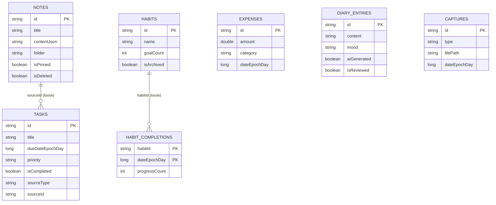

# 05 — Database

## Provider

**Room** (`androidx.room`, version 2.6.1) on top of **SQLite** — a fully
local, on-device database. There is no cloud/remote database. Confirmed by
`app/src/main/java/com/lifeos/app/data/db/AppDatabase.kt` (opened through
SQLCipher's `SupportOpenHelperFactory`, file name from
`DatabasePassphraseProvider.DATABASE_NAME`):

```kotlin
System.loadLibrary("sqlcipher")
val passphrase = DatabasePassphraseProvider.getOrCreate(context.applicationContext)
Room.databaseBuilder(
    context.applicationContext,
    AppDatabase::class.java,
    DatabasePassphraseProvider.DATABASE_NAME
)
    .openHelperFactory(SupportOpenHelperFactory(passphrase))
    .build()
```

- **File location on device**: internal app storage, filename `lifeos.db`
- **Encryption at rest**: SQLCipher; passphrase is random per install and
  wrapped by an Android Keystore AES-GCM key — see `docs/08_SECURITY.md`.
- **Schema version**: `2`
- **Migrations**: `MIGRATION_1_2` in `AppDatabase.kt` upgrades v1 → v2 by
  creating the index set below (`CREATE INDEX IF NOT EXISTS` for each). No
  destructive fallback is configured — if a future schema change lands without
  a `Migration`, the app will crash on upgrade rather than silently deleting
  data. See `docs/16_KNOWN_ISSUES.md`.
- **Schema export**: `app/build.gradle.kts` configures
  `room.schemaLocation = "$projectDir/schemas"`; exported schemas are
  committed at `app/schemas/com.lifeos.app.data.db.AppDatabase/1.json` (v1,
  unchanged) and `2.json` (v2).

## Tables (entities)

### `notes` — `data/db/entities/NoteEntity.kt`

| Field | Type | Notes |
|---|---|---|
| id | String (PK) | UUID, generated by `core/util/IdGenerator.kt` |
| title | String | |
| contentJson | String | Serialized `List<NoteBlock>` (see `domain/model/NoteBlock.kt`) |
| plainTextForSearch | String | Flattened text used by `NoteDao.search()`'s `LIKE` query |
| folder | String? | Free text; e.g. "College", "Projects" |
| tagsCsv | String | Comma-separated tags |
| isPinned | Boolean | default false |
| isFavorite | Boolean | default false |
| isArchived | Boolean | default false |
| isDeleted | Boolean | default false — soft delete (Trash) |
| createdAt | Long | epoch millis |
| updatedAt | Long | epoch millis |
| attachmentsJson | String | Serialized `List<AttachmentRef>`, default `"[]"` |

### `tasks` — `data/db/entities/TaskEntity.kt`

| Field | Type | Notes |
|---|---|---|
| id | String (PK) | |
| title | String | |
| description | String? | |
| dueDateEpochDay | Long? | `LocalDate.toEpochDay()` |
| dueTimeMinutes | Int? | minutes since midnight |
| priority | enum TaskPriority | HIGH / MEDIUM / LOW |
| category | String? | |
| reminderEpochMillis | Long? | drives `ReminderScheduler` |
| repeatRule | enum RepeatRule | NONE / DAILY / WEEKLY / MONTHLY / CUSTOM_DAYS — ⚠️ stored but not yet acted on by any scheduler |
| repeatDaysCsv | String? | e.g. "MON,WED,FRI" |
| isCompleted | Boolean | |
| completedAtEpochMillis | Long? | |
| isDeleted | Boolean | soft delete |
| notes | String? | |
| attachmentsJson | String | default "[]" |
| sourceType | String? | "note" \| "diary" \| "voice" \| "ai" \| null — links back to what created the task |
| sourceId | String? | id of the source note/diary/etc. |
| createdAt / updatedAt | Long | |

### `habits` — `data/db/entities/HabitEntity.kt`

| Field | Type | Notes |
|---|---|---|
| id | String (PK) | |
| name | String | |
| icon | String | emoji |
| category | String? | |
| frequency | enum HabitFrequency | DAILY / WEEKLY / CUSTOM |
| customDaysCsv | String? | for CUSTOM frequency |
| goalCount | Int | default 1; supports quantity habits |
| reminderEpochMillis | Long? | |
| startDateEpochDay | Long | |
| isArchived | Boolean | |
| createdAt / updatedAt | Long | |

### `habit_completions` — `data/db/entities/HabitEntity.kt` (`HabitCompletionEntity`)

Composite primary key: **(`habitId`, `dateEpochDay`)** — one row per habit per day.

| Field | Type | Notes |
|---|---|---|
| habitId | String | FK by convention only — ⚠️ no `@ForeignKey` constraint declared in the `@Entity` annotation |
| dateEpochDay | Long | |
| progressCount | Int | compared against the parent habit's `goalCount` |
| completedAtEpochMillis | Long | |

### `expenses` — `data/db/entities/ExpenseEntity.kt`

| Field | Type | Notes |
|---|---|---|
| id | String (PK) | |
| amount | Double | |
| category | String | free text, validated against `domain/model/Categories.kt`'s list in the UI only, not at the DB layer |
| dateEpochDay | Long | |
| timeMinutes | Int | |
| merchant | String? | |
| paymentMethod | enum PaymentMethod | CASH / UPI / CARD / BANK / OTHER |
| note | String? | |
| tagsCsv | String | |
| createdAt | Long | |

### `diary_entries` — `data/db/entities/DiaryEntity.kt`

| Field | Type | Notes |
|---|---|---|
| id | String (PK) | |
| title | String? | |
| content | String | |
| mood | String? | free text, e.g. "happy" |
| tagsCsv | String | |
| dateEpochDay | Long | |
| timeMinutes | Int | |
| aiGenerated | Boolean | default false |
| isReviewed | Boolean | default true; **false only for unreviewed AI drafts** |
| attachmentsJson | String | default "[]" |
| createdAt / updatedAt | Long | |

### `captures` — `data/db/entities/CaptureEntity.kt`

| Field | Type | Notes |
|---|---|---|
| id | String (PK) | |
| type | enum CaptureType | PHOTO / VIDEO / AUDIO / THOUGHT |
| filePath | String? | null for THOUGHT; app-private path for others |
| thumbnailPath | String? | ⚠️ field exists but nothing in the code currently generates a thumbnail |
| caption | String? | |
| transcript | String? | ⚠️ field exists for speech-to-text but no transcription code exists |
| mood | String? | |
| tagsCsv | String | |
| dateEpochDay / timeMinutes | Long / Int | |
| createdAt | Long | |

## Relationships

There are **no formal `@ForeignKey` relationships declared** in any entity.
Relationships are implicit / convention-based:

- `TaskEntity.sourceId` → id of a `NoteEntity` or `DiaryEntity` (loosely typed as `String?`)
- `HabitCompletionEntity.habitId` → id of a `HabitEntity`

This means Room will **not** automatically cascade-delete completions when
a habit is deleted, or prevent orphaned rows. `HabitRepository.delete()`
only deletes the `HabitEntity` row itself — ⚠️ orphaned `habit_completions`
rows are not cleaned up. See `docs/16_KNOWN_ISSUES.md`.

## Indexes

⚠️ **PRESENT as of v2 (2026-09-22)** — all single-column, Room default names
(`index_<table>_<column>`), backed by `MIGRATION_1_2`:

| Table | Indexed column | Rationale |
|---|---|---|
| notes | `createdAt`, `updatedAt`, `isDeleted` | list ordering + trash filter |
| tasks | `dueDateEpochDay`, `createdAt`, `updatedAt`, `completedAtEpochMillis`, `isDeleted`, `isCompleted` | day views, timeline, completed-range reads |
| habits | `isArchived` | active-habit listing |
| habit_completions | `dateEpochDay` | per-day/range completion reads |
| diary_entries | `dateEpochDay` | calendar/timeline reads |
| expenses | `dateEpochDay` | day/range reads |
| captures | `dateEpochDay` | timeline reads |

No composite indexes yet; the `habit_completions` primary key
(`habitId`, `dateEpochDay`) already covers habit+day lookups. `LIKE` searches
remain unindexed (correct for a local single-user DB).

## Security rules

Not applicable in the traditional sense (no cloud database with rules).
On-device protection is:
- `android:allowBackup="false"` in `AndroidManifest.xml` — the OS will not
  auto-backup the database.
- Optional App Lock (PIN) gates the whole app, not the database file itself.
- **The database file is encrypted at rest with SQLCipher** (OpenSSL-backed),
  with a random per-install passphrase wrapped by an Android Keystore AES-GCM
  key (`core/security/DatabasePassphraseProvider.kt`); the raw passphrase is
  never stored in plaintext. A key-resolution failure is non-destructive: it
  throws `DatabaseKeyUnavailableException` and shows a recovery screen instead
  of rotating the key or deleting data. See `docs/08_SECURITY.md`.

## Read/write operations

All reads/writes go through the DAO interfaces in `data/db/dao/`, wrapped by
the repository classes in `data/repository/`. Every DAO uses either:
- `suspend fun` for one-shot reads/writes, or
- `Flow<T>` for reactive/live reads that Compose screens collect directly.

## Data lifecycle

- **Notes, Tasks**: soft-deleted (`isDeleted = true`) first; notes can be
  restored from Trash or permanently deleted (`NoteRepository.permanentlyDelete()`).
  Tasks have a soft-delete (`TaskRepository.delete()`) but ⚠️ **no Trash UI
  screen or permanent-delete path exists for tasks** in the current UI.
- **Habits**: archived (`isArchived = true`), or hard-deleted via `HabitRepository.delete()`.
- **Expenses, Diary, Captures**: hard-deleted only (`delete()` methods run a real `DELETE` — no soft-delete field exists on these entities).
- **Backup**: `data/repository/BackupRepository.kt` can export every table
  to one JSON file and restore from it — see `docs/04_FEATURES.md` §14.

## Diagram



⚠️ **NOT VERIFIED**: no real production database credentials or connection
strings exist anywhere in this repo to accidentally expose — there is no
remote database.

## Current-state addendum — 2026-09-16

This document remains part of the LifeOS documentation set. Current UI/UX, motion, responsive and accessibility rules are centralized in [`DESIGN.md`](./DESIGN.md). The current Intelligence implementation is local/offline and requires no external AI provider or API key. Build/test statements are only considered verified when the exact command has been executed in a real Android/Gradle environment.

## Current implementation snapshot — 2026-09-16

No Room entity, DAO or schema version was changed for this UI pass; existing local data remains the source for displayed statistics and capture history.

## 2026-09-18 schema note
No Room schema migration was introduced for this UI pass. Profile-photo metadata is a DataStore preference, so existing Room data and migrations remain unchanged.
